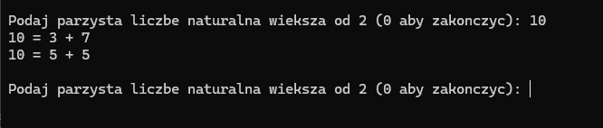

<h1 align="center"> Goldbach's Conjecture – Visual C++</h1>

Ten projekt to prosty program konsolowy napisany w języku C++, który demonstruje **Hipotezę Goldbacha** – niesprawdzoną hipotezę matematyczną mówiącą, że każda parzysta liczba większa od 2 jest sumą dwóch liczb pierwszych. Program pozwala użytkownikowi wpisywać kolejne liczby i sprawdza, czy można je przedstawić jako sumę dwóch liczb pierwszych. Narzędzie działa w sposób interaktywny i edukacyjny.

---

##  Technologie i środowisko

- **Język:** C++  
- **Środowisko IDE:** Visual Studio  
- **Biblioteki:**  
  - `iostream` – obsługa wejścia/wyjścia w konsoli  
  - Brak dodatkowych bibliotek – wykorzystano tylko standardową bibliotekę języka C++

---

  
 Funkcje programu (kliknij, aby rozwinąć)

### 1. `czyPierwsza(int n)`
Funkcja sprawdzająca, czy dana liczba jest liczbą pierwszą.  
Zwraca `true`, jeśli liczba jest pierwsza, `false` w przeciwnym przypadku.  
- Działa w oparciu o dzielenie próbne do pierwiastka z liczby.

---

### 2. `main()`
Główna funkcja programu obsługująca:
- Pętlę wejściową użytkownika
- Walidację wprowadzonej liczby
- Wyszukiwanie par liczb pierwszych sumujących się do danej liczby
- Wyświetlanie wyników w formacie:  
  `10 = 3 + 7`  
  `10 = 5 + 5`
- Komunikat końcowy:  
  `Hipoteza Goldbacha obalona!` (gdy nie znaleziono żadnej pary)

---

### 3. Zmienne pomocnicze:
- `int liczba` – przechowuje liczbę podaną przez użytkownika  
- `bool znaleziono` – flaga informująca, czy znaleziono poprawną parę liczb pierwszych  
- `int i, j` – liczby pierwsze składowe testowane w każdej iteracji

---

  
 Podgląd działania (kliknij, aby rozwinąć)

Poniżej przykład działania aplikacji w terminalu (folder `/images`):

